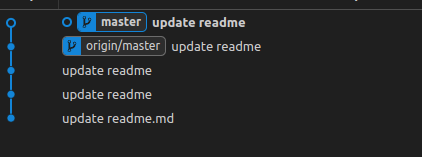

# A tutorial for git

## 1.绑定github信息

```bash
git config --global user.name "i37532"

git config --global user.email 1350181508@qq.com
``` 

## 2.publish branch + 设置代理
- 设置为全局代理

## 3.push推送操作
<div style="text-align: center;">
  
</div>
上面那个是本地，下面那个是远端，不一致

